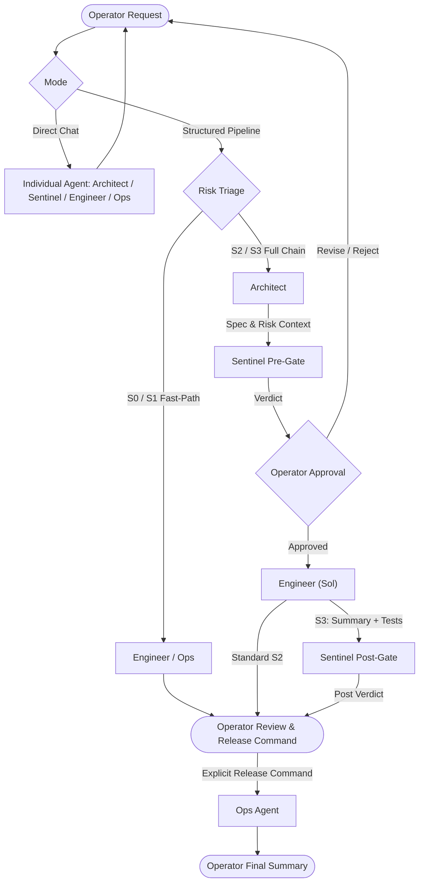

# Sterling Flow Orchestration

Orchestrates multi-agent development workflows across OpenAI Codex environments (CLI, IDEs, desktop, and agent platforms), balancing rigorous quality gating with token economics.

---

## 1. Core Operating Principles

1. **Direct Subagent Access:** The Operator can directly consult, prompt, or chat with any individual subagent (e.g., brainstorming with Architect, spot-checking with Sentinel) without triggering an automated chain.
2. **Operator Absolute Authority:** Subagents cannot trigger irreversible actions. Commits, pushes, deployments, and tag releases are **only** executed when explicitly ordered by the Operator.
3. **Missing Data Escalation:** Subagents must **never guess or fabricate missing context** (e.g. repo names, deploy targets, version numbers, API keys). If required data is missing from project docs or environment, the subagent must immediately halt and prompt the Operator for clarification.
4. **Token Optimization & Verbosity Control:**
   - **No Raw Diffs in Output:** The IDE handles visual diffing. Agents never dump full code diffs into chat context.
   - **Inter-Agent Protocol:** Strictly factual and minimal; agents only pass necessary parameters, constraints, and contracts.
   - **Operator Output:** Concise executive summaries (files changed, test results, next decision). Target ≤ 100 words.

---

## 2. Model Tier & Effort Matrix

| Tier | Codex Model | Default Effort | Speed | Primary Roles |
| :--- | :--- | :--- | :--- | :--- |
| **Sol** | `gpt-5.6-sol` | `medium` / `high` | Normal | **Engineer** (S2/S3 complex implementation & refactoring) |
| **Terra** | `gpt-5.6-terra` | `medium` | Fast / Normal | **Architect** (Specs), **Sentinel** (Risk Gate), **Ops** (Release), **Engineer** (S0/S1) |
| **Luna** | `gpt-5.6-luna` | `low` | Fast | **Helper** (Leaf text formatting, summaries, bullet extraction) |

> [!TIP]
> `xhigh` effort is excluded by default to prevent token exhaustion on standard subscriptions. Sol defaults to `high` for critical tasks and `medium` for standard implementation.

---

## 3. Risk Levels & Routing Paths

Evaluate task risk before spawning multi-agent chains:

- **`S0` (Trivial / Docs / Formatting):** Direct execution by **Ops** or **Engineer** (`Terra` or `Luna`).
- **`S1` (Low Risk / Localized Bugfix):** **Engineer** (`Terra`, medium effort) implements directly with tests. Sentinel pre/post review is skipped.
- **`S2` (Medium Risk / Multi-file / API changes):** Full Chain: `Architect` → `Sentinel` (Pre-gate) → **Operator Approval** → `Engineer` (`Sol`, high effort) → **Operator Review**.
- **`S3` (High Risk / Auth / Data Schema / Invariants):** Mandatory Full Chain: `Architect` → `Sentinel` (Pre-gate) → **Operator Approval** → `Engineer` (`Sol`) → `Sentinel` (Post-gate) → **Operator Approval** → `Ops`.

---

## 4. Subagent Roster

Detailed prompts, constraints, and contracts are in [references/agents.md](references/agents.md):

1. **Architect (`Terra` / Medium / Fast):** Scoping, user flows, constraints, acceptance criteria. *Read-only.*
2. **Sentinel (`Terra` / High / Normal):** Independent risk gatekeeper. Issues verdicts (`GO`, `CONDITIONAL GO`, `INSUFFICIENT EVIDENCE`, `NO-GO`). *Read-only.*
3. **Engineer (`Sol` or `Terra` / Medium or High / Normal):** Directly modifies code and authors tests. Outputs high-level bulleted changes, design liberties/rationales, and test metrics (count created + execution outcome).
4. **Ops (`Terra` / Medium / Fast):** Reads project docs (`README.md`, `DEPLOYMENT.md`, configs) to handle commits, pushes, and deployments **only when explicitly ordered by the Operator**.
5. **Helper (`Luna` / Low / Fast):** Leaf text worker for simple transforms, summaries, and formatting.

---

## 5. Orchestration Flow & Gating Rules

For full Sentinel review rules and escalation triggers, consult [references/sentinel-protocol.md](references/sentinel-protocol.md).
